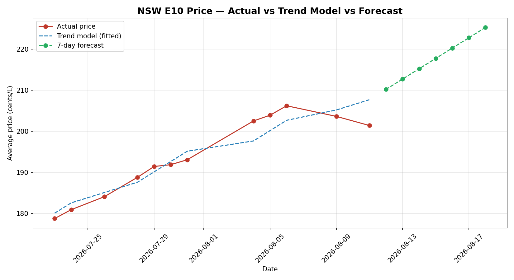

# NSW Fuel Price Cycle Analysis

A data pipeline that tracks petrol prices across New South Wales using the government's live FuelCheck API, then digs out the pricing cycle underneath the day-to-day noise, forecasts where prices head next, and serves it all through a live interactive dashboard.

**Live dashboard:** https://nsw-fuel-price-analysis.streamlit.app

An interactive Streamlit app where you can explore the price cycle and forecast by fuel type, with live metrics and a comparison across all fuel grades.

## Background

I spent over a year working the counter at an Ampol service station. One thing you pick up fast is that fuel prices don't move randomly. They grind upward for a week or two, hit a peak, then drop hard almost overnight, and the whole thing starts over. This project was me checking whether the data actually backs up the pattern I'd been watching from behind the register.

## What it does

It collects a full snapshot of every NSW station's fuel prices on a schedule, stamps each snapshot with a time, and builds a price history over time. Once there's enough history, it cleans the data, charts the cycle across every fuel grade, forecasts the next few days, and presents everything in a live dashboard anyone can open.

Collection runs on its own. A cron job calls the collector every few hours, so the dataset keeps growing without me touching it.

## Data

- Source: NSW Government FuelCheck API (OAuth2)
- Coverage: ~3,300 stations statewide, 10 fuel types
- Window: 23 July onward (dataset keeps growing)
- ~328,000 timestamped price records after removing duplicate pulls

## Findings

Across the collection window the data showed a clean cycle: a steady climb to a peak around 5-6 August, then the start of a sharp fall.

A few things stood out:

- Every fuel grade moved together. E10, unleaded 91, premium 95/98 and diesel all traced the same climb-and-crash shape, which points to a market-wide cycle rather than station-level noise.
- Regular unleaded (E10) swung about 27 c/L from trough to peak.
- Diesel moved the most, climbing over 30 c/L.
- Premium grades held a roughly constant margin above regular the whole way through, instead of widening or narrowing across the cycle.


## Forecasting

Beyond describing the cycle, I built a short-term price forecast and tested it properly rather than eyeballing it.

**Method:** predict the next day's average price, then measure error against a naive baseline (tomorrow = today). Any model has to beat that baseline to be worth using.

**Result:**

| Model | MAE (c/L) | RMSE (c/L) |
|-------|-----------|------------|
| Naive baseline | 2.93 | 3.74 |
| Linear trend | 2.45 | 2.97 |

The trend model beats the naive baseline by roughly 16%, on a deliberately short dataset that keeps growing as collection continues.



**Honest limitation:** a linear trend can only project prices upward, so it can't capture the crash that ends each cycle. Modelling the full cycle needs more accumulated data and a seasonal approach (e.g. Prophet or SARIMA), which is the next step as the dataset grows.

## The dashboard

`dashboard.py` is a Streamlit app that turns the analysis into a live tool. It shows current metrics (latest price, cycle peak, stations tracked), lets you switch between fuel types, plots the cycle and 7-day forecast, reports how the forecast compares to the naive baseline, and charts all fuel grades side by side. It's deployed free on Streamlit Community Cloud and updates automatically whenever new code is pushed.

## How it works

**`collect_prices.py`**
- Authenticates against the FuelCheck OAuth endpoint
- Pulls current prices for every station
- Appends each pull to `fuel_prices_history.csv` with a timestamp

The analysis notebook loads that CSV, drops duplicate pulls, groups by day and fuel type, builds the charts, and fits the forecast. The dashboard reads the same data and presents it interactively.

API credentials are kept out of the code in a local `.env` file, which isn't committed.

## Stack

Python, pandas, NumPy, matplotlib, Streamlit, requests, cron.

## Running it yourself

1. Register for a free FuelCheck API key at the [NSW API portal](https://api.nsw.gov.au).
2. Add your key and secret to a `.env` file in the project root:
   ```
   API_KEY=your_key
   API_SECRET=your_secret
   ```
3. Install the dependencies:
   ```
   pip install requests pandas numpy matplotlib streamlit python-dotenv
   ```
4. Run `python3 collect_prices.py` to collect a snapshot, or schedule it with cron to build history automatically.
5. Run `streamlit run dashboard.py` to launch the dashboard locally.

## Next steps

The current version documents the cycle, forecasts short-term with a validated baseline, and serves it all through a live dashboard. The next stage is a seasonal model (Prophet or SARIMA) that can capture the full climb-and-crash cycle, and saving station names and locations so the dashboard can map the cheapest fuel nearby.
