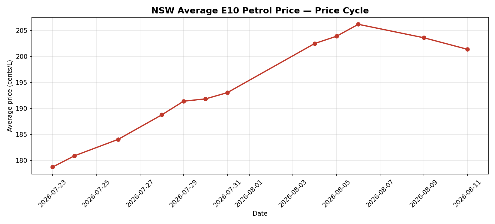
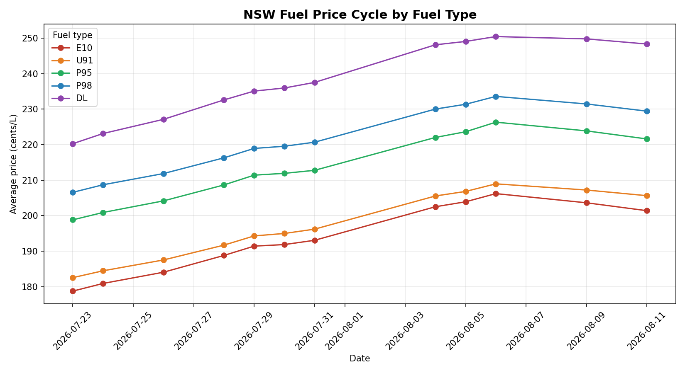
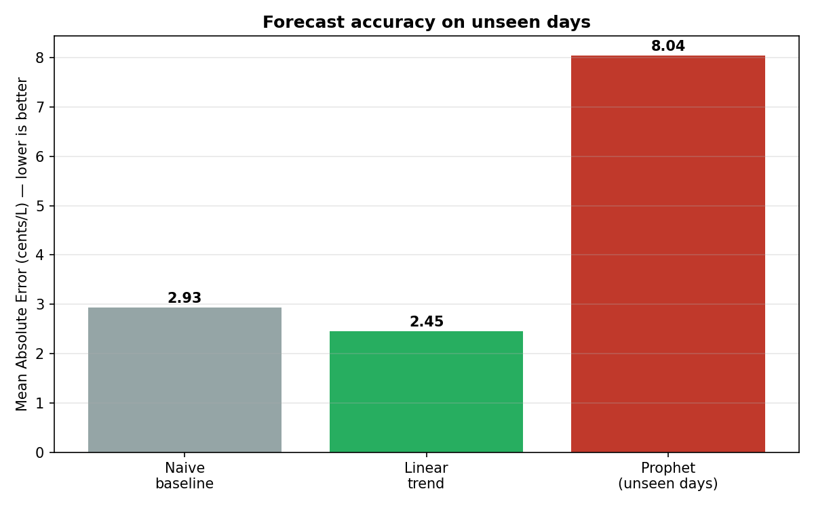

# ⛽ NSW Fuel Price Analysis

Tracking petrol price cycles across New South Wales with live government data — from raw API to a deployed app that tells you where the cheapest fuel is and whether now's a good time to fill up.

**🔗 Live app:** https://nsw-fuel-price-analysis.streamlit.app

---

## The idea

I work at an Ampol service station. Behind the counter you start to notice that fuel prices aren't random — they climb for a week or two, hit a peak, then crash almost overnight, and the cycle repeats. I wanted to know if the data actually proved the pattern I was watching every shift. So I built a pipeline to find out.

---

## What it does

An automated collector pulls live prices from every NSW station on a schedule and builds a price history over time. From that data, the project:

- maps out the full price cycle and forecasts where prices head next
- compares fuel grades and brands
- plots every station on a live map, coloured by price
- lets anyone find the cheapest fuel near them by suburb, postcode, or their actual location

Collection runs on its own every few hours, so the dataset keeps growing.

**Data:** NSW Government FuelCheck API · ~3,300 stations · 10 fuel types · hundreds of thousands of timestamped records.

---

## What the data showed

The cycle is real, and it's market-wide — every fuel grade moves in step, which rules out random station-level noise.



Regular unleaded swings around **27 c/L** from the bottom of the cycle to the peak, diesel moves the most, and premium grades hold a steady margin above regular the whole way through.



---

## Forecasting — and testing it honestly

Spotting the cycle was only half of it. I wanted to forecast short-term prices and *prove* a model added value, not just trust a chart that looked right. Every model was measured against a naive baseline: assume tomorrow's price equals today's. Anything that can't beat that is useless.

| Model | Error on unseen days (c/L) |
|-------|----------------------------|
| Naive baseline | 2.93 |
| Linear trend | 2.45 |
| Prophet (seasonal) | 8.04 |



The simple linear model beat the baseline. The seasonal Prophet model, tested properly on days it had never seen, did **worse** — and that's the finding worth reporting. On a short dataset Prophet overfits; it needs several full cycles before it can learn the pattern. When I first measured Prophet on its own training data it scored a suspiciously perfect 0.38 — a reminder that a model is only ever as good as its performance on data it hasn't seen. The honest 8.04 matters more than a number that just looks good.

The framework is in place, so as more full cycles accumulate the seasonal model should overtake the simpler ones on its own.

---

## The live app

The analysis is wrapped in an interactive dashboard, organised into tabs:

- **📈 Price Cycle** — the cycle, the 7-day forecast, and the model comparison
- **🏷️ By Brand** — which brands run cheapest and priciest, and the gap between them
- **🗺️ Live Map** — every station on a dark interactive map, coloured by price, with brand, address, price and last-updated time on each point
- **🔍 Find Fuel** — cheapest fuel near you by suburb, postcode, or GPS location, sorted by price and distance

A **"should I fill up now?"** indicator sits up top, reading where the current price sits in the cycle and giving a straight verdict.

---

## How it works

`collect_prices.py` authenticates with the FuelCheck OAuth endpoint, pulls current prices and station details for every station, and appends each snapshot to the price history with a timestamp. The notebook cleans the data, builds the charts, and fits the forecasts. The dashboard reads the same data and serves it interactively. API keys are kept out of the code in a local `.env` file.

**Built with:** Python · pandas · NumPy · matplotlib · Prophet · Streamlit · Plotly · cron

---

## Run it yourself

1. Get a free FuelCheck API key at the [NSW API portal](https://api.nsw.gov.au).
2. Add your credentials to a `.env` file:
   ```
   API_KEY=your_key
   API_SECRET=your_secret
   ```
3. Install dependencies:
   ```
   pip install requests pandas numpy matplotlib prophet streamlit plotly python-dotenv
   ```
4. `python collect_prices.py` to collect data (or schedule it with cron).
5. `streamlit run dashboard.py` to launch the app.

---

## Next steps

Making the app pull live from the FuelCheck API on load, so the data stays current with no manual updates — then brand logos on the map markers, and a stronger seasonal model once enough cycles are collected.

---

*Built by Ankur Bajaj — Computer Science (Data Science) student at Deakin University, and someone who's watched these prices from behind the counter.*
